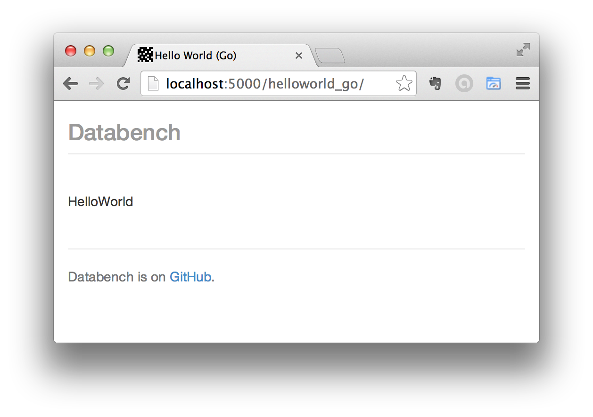

# databench_go

> [Go](http://golang.org/) language kernel for [Databench](http://www.svenkreiss.com/databench/). Write your data analysis in Go and visualize and interact with it in the browser.

<!--

-->

Install using

    go get github.com/svenkreiss/databench_go/databench

and add `github.com/svenkreiss/databench_go/databench` to your imports.

### Testing / Examples

The `analyses` folder is an example setup and can act as a template for your own Databench analyses with Go. Dependencies for this are installed with

    pip install -r requirements_analyses.txt

### Troubleshooting

* `libzmq`: On a Mac, install using `brew install zmq`. To run on linux, make sure you have version 4 of `libzmq`.
